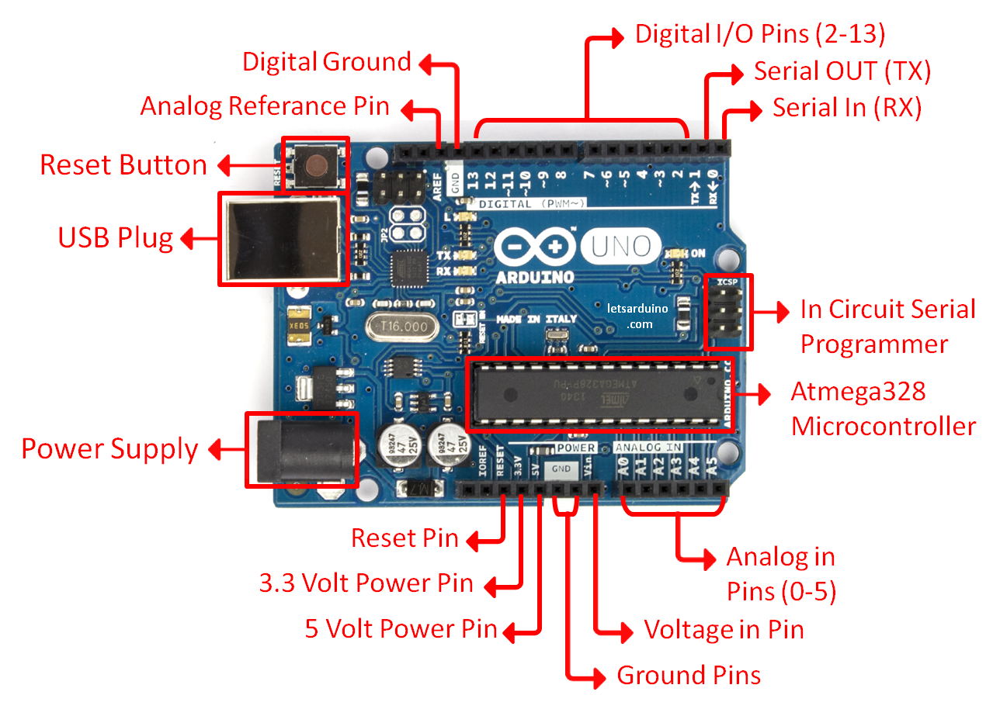

# Week 1 - Introduction to Robotics & Arduino Basics

**Deliverable:** Blink the built-in LED using the Arduino IDE.

---

## 1. Background

### 1.1 What is a Microcontroller?

A microcontroller is a compact circuit that contains a processor, memory, and programmable input/output pins on a single chip. Unlike a general-purpose computer, a microcontroller is designed to execute one program repeatedly, making it great for different types of devices, including those we would use in Robotics.

The Arduino Uno is built around the ATmega328P microcontroller. It exposes the chip's functionality through a set of numbered pins on the board, which can be connected to external components such as LEDs, sensors, and motors.

### 1.2 Arduino Board Overview

The Uno provides 14 digital I/O pins (numbered 0-13), which operate at 0V (LOW) or 5V (HIGH), and 6 analog input pins (A0-A5) which can read a continuous voltage range of 0–5V. A USB port handles both power and program upload. The board also exposes a regulated 5V output pin and multiple GND (ground) pins, which serve as the common return path for all circuits.



### 1.3 The Arduino IDE

The Arduino IDE is the application used to write, compile, and upload programs to the board. Programs written for Arduino are called **sketches** and are saved as `.ino` files.

Every Arduino sketch must define exactly two functions:

```cpp
void setup() {
    // Runs once when the board powers on or is reset.
    // Used to configure pins and initialise components.
}

void loop() {
    // Runs continuously after setup() completes.
    // Contains the main program logic.
}
```

The board's execution model is straightforward: `setup()` runs once, then `loop()` repeats indefinitely. There is no operating system, we talk (almost) directly to hardware.

### 1.4 Wokwi Circuits

Wokwi is a browser-based simulator that allows circuits to be designed and tested without physical hardware. It supports Arduino code and simulates the behaviour of common components. Students are expected to prototype their circuits in Wokwi before building them on a physical breadboard.

---

## 2. Concepts

### 2.1 Pin Modes

Before a digital pin can be used, the program must declare whether it will send signals or receive them. This is done with `pinMode()` inside `setup()`:

```cpp
pinMode(pin, OUTPUT); // pin will send voltage
pinMode(pin, INPUT);  // pin will read voltage
```

Calling `digitalWrite()` on a pin that has not been configured as `OUTPUT` produces undefined behaviour and should always be avoided.

### 2.2 Digital Output

`digitalWrite()` sets a digital output pin to one of two voltage states:

```cpp
digitalWrite(pin, HIGH); // Sets pin to 5V
digitalWrite(pin, LOW);  // Sets pin to 0V
```

When a pin is HIGH and an LED is connected through a current-limiting resistor to GND, current flows through the circuit and the LED illuminates.

### 2.3 The `delay()` Function

`delay(ms)` pauses program execution for a specified number of milliseconds. During this pause the processor cannot read inputs, update outputs, or perform any other work.


---

## 3. Circuit

### Components required

- 1× Arduino Uno
- 1× LED (any colour)
- 1× 220Ω resistor
- 2-3× jumper wires
- 1× breadboard

For the basic deliverable, no external components are needed, `LED_BUILTIN` refers to the on-board LED. The external LED circuit below is used for the extension tasks.

### Wiring (external LED on pin 13)

The LED anode (longer leg) connects through a 220Ω resistor to pin 13. The cathode (shorter leg) connects to GND. The resistor is mandatory, without it our LED will evetually be cooked (burned)


---

## 4. Code

```cpp
void setup() {
    pinMode(LED_BUILTIN, OUTPUT);
}

void loop() {
    digitalWrite(LED_BUILTIN, HIGH);
    delay(1000);
    digitalWrite(LED_BUILTIN, LOW);
    delay(1000);
}
```

### Explanation

`pinMode(LED_BUILTIN, OUTPUT)` runs once at startup and configures pin 13 as an output. This call is required before the pin can be driven with `digitalWrite()`.

Inside `loop()`, `digitalWrite(LED_BUILTIN, HIGH)` sets pin 13 to 5V, causing current to flow through the LED circuit and illuminating the LED. `delay(1000)` then holds this state for exactly 1000 milliseconds. `digitalWrite(LED_BUILTIN, LOW)` sets the pin back to 0V, extinguishing the LED, followed by another 1000ms pause. When `loop()` reaches its closing brace, it immediately starts again from the top, producing a continuous 2-second blink cycle: 1 second on, 1 second off.

