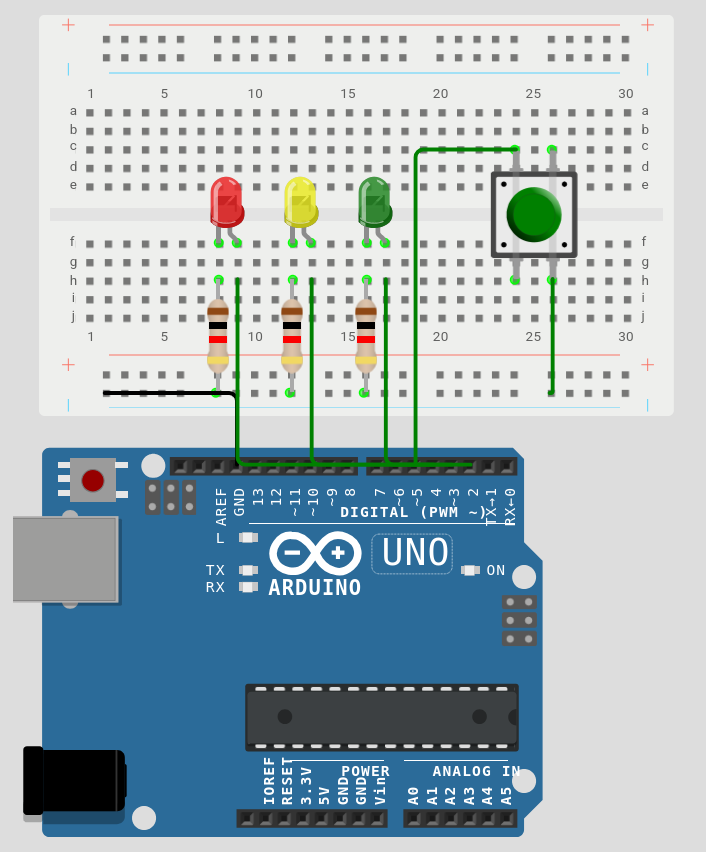

# Week 2 - Digital I/O & Control Structures

**Deliverable:** A traffic light sequence using three LEDs and a button input.

---

## 1. Background

### 1.1 Digital Signals

A digital signal has exactly two states: HIGH (5V) or LOW (0V). This maps directly to binary logic - 1 or 0. All of the Arduino's digital pins operate on this principle. There is no in-between value on a digital pin.

This week introduces both sides of digital communication: output (driving an LED) and input (reading a button).

### 1.2 Multiple Output Pins

In Week 1 a single pin was used. A program can configure and control any number of pins simultaneously. Each pin must be individually declared with `pinMode()` in `setup()`, and each can be driven independently with `digitalWrite()` at any point in `loop()`.

### 1.3 Digital Input and `digitalRead()`

`digitalRead()` returns the current state of an input pin:

```cpp
int state = digitalRead(pin); // returns HIGH or LOW
```

The pin must first be configured as `INPUT` in `setup()`. 

---


## 2. Circuit

### Components required

- 1× Arduino Uno
- 3× LEDs (red, yellow, green)
- 3× 220Ω resistors
- 1× push button
- Jumper wires
- Breadboard


### Wiring

Each LED (Red - pin 2, Yellow - pin 3, Green - pin 4) is wired through a 220Ω resistor and a button in the breadboard middle (pin 5).




---

## 3. Code

```cpp
const int RED = 2;
const int YELLOW = 3;
const int GREEN = 4;
const int BUTTON = 5;

void setup() {
    pinMode(RED, OUTPUT);
    pinMode(YELLOW, OUTPUT);
    pinMode(GREEN, OUTPUT);
    pinMode(BUTTON, INPUT);

    digitalWrite(RED, HIGH); // idle state: red on
}

void loop() {
    if (digitalRead(BUTTON) == LOW) {
        delay(50);
        if (digitalRead(BUTTON) == LOW) {
            while (digitalRead(BUTTON) == LOW); // wait for release

            // Red
            digitalWrite(RED, HIGH);
            digitalWrite(YELLOW, LOW);
            digitalWrite(GREEN, LOW);
            delay(5000);

            // Red + Yellow (prepare to go)
            digitalWrite(RED, HIGH);
            digitalWrite(YELLOW, HIGH);
            digitalWrite(GREEN, LOW);
            delay(2000);

            // Green
            digitalWrite(RED, LOW);
            digitalWrite(YELLOW, LOW);
            digitalWrite(GREEN, HIGH);
            delay(5000);

            // Yellow (prepare to stop)
            digitalWrite(RED, LOW);
            digitalWrite(YELLOW, HIGH);
            digitalWrite(GREEN, LOW);
            delay(2000);

            // Back to Red
            digitalWrite(RED, HIGH);
            digitalWrite(YELLOW, LOW);
            digitalWrite(GREEN, LOW);
        }
    }
}
```

### Explanation

Before the `setup()` function constant variables are declared, therefore we cannot change them further. It is used in order to reuse the same pins and to make code less redundant.

`setup()` configures pins for LED (output) and button (input) pins

Inside `loop()` the sequence proceeds as follows:

The outer if `(digitalRead(BUTTON) == LOW)` checks whether the button is being pressed. Because `INPUT` is active, the pin sits at HIGH normally and only reads LOW when the button connects it to GND. If the button is not pressed, `loop()` returns immediately and checks again on the next iteration.

When a `LOW` is detected, `delay(50)` pauses for 50 milliseconds to allow the button contacts to stop bouncing. The second if `(digitalRead(BUTTON) == LOW)` then confirms the pin is still LOW - if it was electrical noise rather than a real press, the pin will have returned to HIGH by now and nothing happens.

`while (digitalRead(BUTTON) == LOW)` holds the program until the button is physically released. 

Each phase sets all three LEDs explicitly - `HIGH` or `LOW` - before calling `delay()`. This is intentional: rather than only writing the line that changes from the previous phase, every phase declares the full state of the circuit, making each block independently readable without having to trace what carried over from before.

The phases run in order: red alone for 5 seconds, red+yellow for 2 seconds (prepare to go), green alone for 5 seconds, yellow alone for 2 seconds (prepare to stop), then red again. When the final digitalWrite returns the circuit to red, `loop()` reaches its closing brace and restarts.

The code can be simplified using custom functions, which we will cover on Week 4


