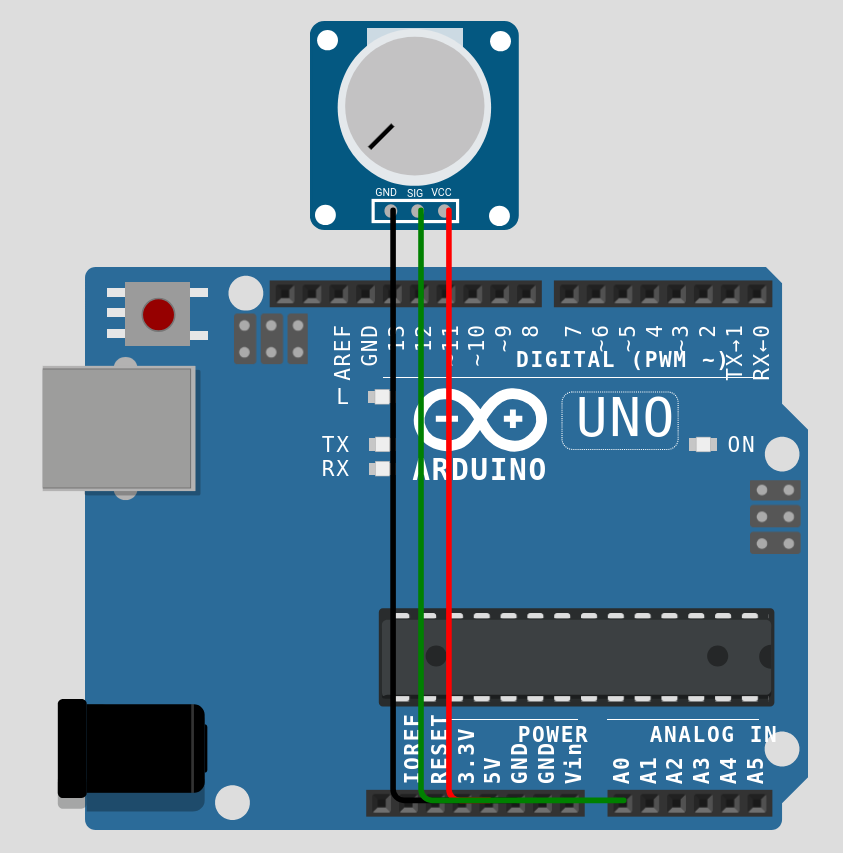
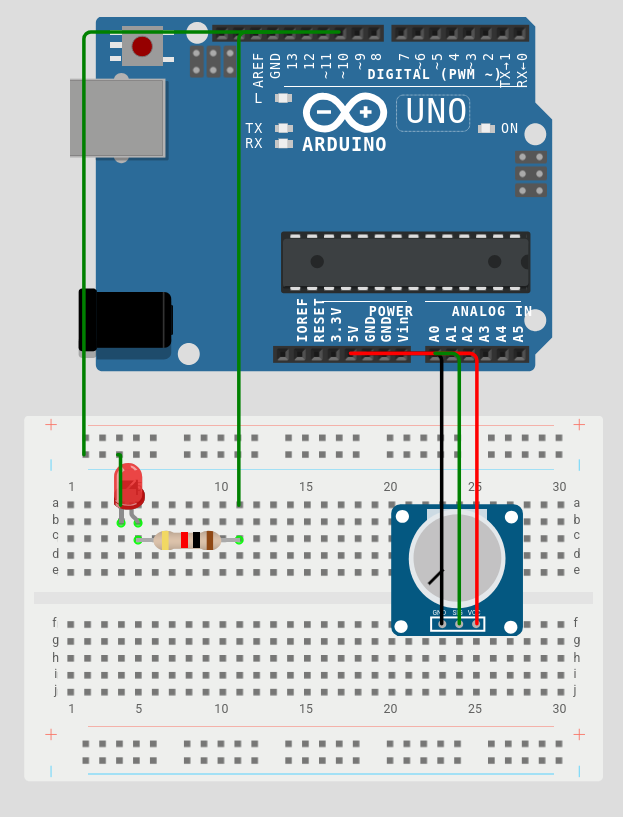

# Week 3 - Analog I/O & Serial Communication

**Deliverable:** A dimmer circuit in which a potentiometer controls LED brightness via PWM.

---

## 1. Background

### 1.1 Analog vs. Digital Signals

The digital signals introduced in Week 2 have exactly two states. Analog signals, by contrast, vary continuously across a range. Physical phenomena such as temperature, pressure, light intensity, rotational position are analog in nature. To work with them in a digital system, they must be converted to a numerical representation.

The ATmega328P contains an Analog-to-Digital Converter (ADC) accessible through pins A0-A5. The ADC measures the voltage present on a pin (0-5V) and converts it to an integer between 0 and 1023. This 10-bit resolution means the 5V range is divided into 1024 discrete steps, giving a step size of approximately 4.9mV.

### 1.2 The Potentiometer

A potentiometer is a three-terminal resistive component. The two outer terminals are connected to a fixed voltage and GND respectively. The middle terminal (the wiper) slides along the resistive element as the knob is turned, producing an output voltage proportional to the knob's position. When the outer terminals are connected to 5V and GND, the wiper voltage ranges from 0V to 5V, which maps directly to an `analogRead()` range of 0 to 1023.



### 1.3 Pulse Width Modulation (PWM)

A digital output pin can only be fully on (5V) or fully off (0V). However, by switching the pin on and off very rapidly, the average voltage delivered to a component can be controlled. This technique is called Pulse Width Modulation.

The ratio of on-time to the total cycle period is the **duty cycle**, expressed as a percentage. A 50% duty cycle means the pin is HIGH for exactly half of each cycle, producing an average output voltage of 2.5V. At 25%, the average is 1.25V; at 100%, the pin is continuously HIGH.

On the Arduino Uno, PWM is available on pins marked with a tilde (~): pins 3, 5, 6, 9, 10, and 11. The `analogWrite()` function accepts a value between 0 (0% duty cycle, always off) and 255 (100% duty cycle, always on).

Note that `analogWrite()` does not produce a true analog voltage, it produces a rapidly switching digital signal. The LED (or motor, or anything else) integrates this signal over time, responding to the average voltage. For an LED this is perceived as reduced brightness.

### 1.4 The `map()` Function

The `map()` function linearly rescales a value from one range to another:

```cpp
map(value, fromLow, fromHigh, toLow, toHigh)
```

Since `analogRead()` returns 0-1023 and `analogWrite()` accepts 0-255, the two ranges must be reconciled. `map()` performs this conversion in a single readable line:

```cpp
brightness = map(potValue, 0, 1023, 0, 255);
```

Internally, `map()` applies the formula: `(value - fromLow) * (toHigh - toLow) / (fromHigh - fromLow) + toLow`.

---

## 2. Circuit

### Components required

- 1× Arduino Uno
- 1× LED (any colour)
- 1× 220Ω resistor
- 1× 10kΩ potentiometer
- Jumper wires
- Breadboard

### Wiring




---

## 3. Code

```cpp
const int potPin = A0;
const int ledPin = 10;

int potValue = 0;
int brightness = 0;

void setup() {
    pinMode(ledPin, OUTPUT);
}

void loop() {
    potValue = analogRead(potPin);
    brightness = map(potValue, 0, 1023, 0, 255);
    analogWrite(ledPin, brightness);
    delay(10);
}
```

### Explanation

Two `const int` declarations at the top of the file name the pins. Using named constants rather than raw numbers means that if the circuit is rewired to a different pin, only one line needs to change.

Two `int` variables, `potValue` and `brightness`, are declared globally. They are initialised to 0 and will be overwritten on every iteration of `loop()`.

In `setup()`, only `ledPin` requires a `pinMode()` call. Analog input pins are always in input mode.

Inside `loop()`:

`analogRead(potPin)` samples the voltage on A0 and returns an integer from 0 to 1023. This value is stored in `potValue`.

`map(potValue, 0, 1023, 0, 255)` rescales the ADC range to the PWM range and stores the result in `brightness`. When the potentiometer is at its minimum position, `potValue` is 0 and `brightness` is 0. At maximum, `potValue` is 1023 and `brightness` is 255.

`analogWrite(ledPin, brightness)` applies the PWM signal to pin 10 at the calculated duty cycle. The LED's perceived brightness changes proportionally.

`delay(10)` introduces a 10ms pause between readings. Without it, the ADC would be sampled thousands of times per second. A small delay smooths the response and reduces electrical noise, without making the dimmer feel sluggish to the user


