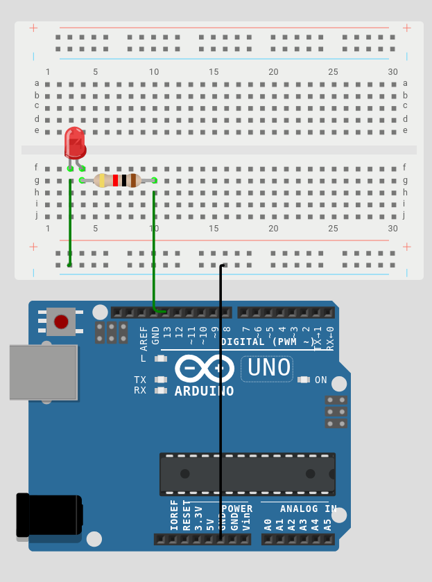

# Week 4 - Functions & Code Organization

**Deliverable:** A Morse code transmitter: the user types a word into the Serial Monitor and the LED flashes the corresponding Morse code sequence.

---

## 1. Background

### 1.1 Why Functions?

As programs grow, placing all logic inside `loop()` becomes horrific and is considered as bad coding practice. The same sequence of instructions may be needed in multiple places. When a bug is found, it must be fixed everywhere it appears.

A **function** is a named, reusable block of code. It is defined once and can be called from anywhere in the program. When the same behaviour is needed in multiple places, one function call replaces what would otherwise be duplicated code.

### 1.2 Defining a Function

The general syntax for a function in C/C++ is:

```cpp
returnType functionName(parameterType parameterName, ...) {
    // body of function
}
```

A concrete example from this week's sketch:

```cpp
void dot() {
    digitalWrite(LED, HIGH); delay(dotLength);
    digitalWrite(LED, LOW);  delay(dotLength);
}
```

`void` is the return type, this function performs an action but does not calculate and return a value. `dot` is the function name. The parentheses are empty because this function takes no parameters, it uses the globally declared `LED` and `dotLength` variables directly.

### 1.3 Parameters

Parameters allow the caller to pass data into a function. The function `flashLetter()` in this week's sketch takes a single parameter:

```cpp
void flashLetter(char c) { ... }
```

`char` is the data type (a single character). `c` is the parameter name - a local variable that holds the value passed by the caller. When `flashLetter('a')` is called, `c` holds the value `'a'` for the duration of that function's execution.

### 1.4 Return Values

A function declared with a return type other than `void` must use the `return` keyword to send a value back to the caller:

```cpp
int getSpeed() {
    return map(analogRead(A0), 0, 1023, 50, 500);
}

int spd = getSpeed(); // spd receives the returned value
```

This week's sketch uses only `void` functions. Exploring return values is left as an extension task.

### 1.5 Variable Scope

The **scope** of a variable determines which parts of the program can access it.

A variable declared outside all functions, at the top of the file, is **global** - every function in the program can read and modify it. The `dotLength` variable in this sketch is global: `dot()`, `dash()`, `letterGap()`, and `wordGap()` all reference it without needing it passed as a parameter.

A variable declared inside a function is **local** - it exists only while that function is executing and is invisible to all other functions. The loop variable `i` inside `flashWord()` is local: it is created when the loop starts and destroyed when the function returns.

Using global variables unnecessarily creates hidden dependencies between functions and makes programs harder to reason about. A variable should be made global only if it genuinely needs to be shared across multiple functions.

### 1.6 The `switch` Statement

A `switch` statement evaluates a single expression and branches to the matching `case`. It is functionally equivalent to a chain of `if / else if` statements (hello to yandere dev) but is cleaner when there are many values to handle:

```cpp
switch (c) {
    case 'a': dot(); dash(); break;
    case 'b': dash(); dot(); dot(); dot(); break;
    // ...
}
```

Each `case` must end with `break`, which exits the `switch` block.

### 1.7 Serial Communication

The Arduino can send and receive text through its USB connection using the `Serial` library. This allows the program to receive input from the user's keyboard and send some message back to the screen.

`Serial.begin(9600)` initialises the serial port at 9600 baud (bits per second) and must be called in `setup()`. `Serial.available()` returns the number of bytes waiting in the receive buffer. `Serial.readStringUntil('\n')` reads the incoming text up to the newline character that Enter produces. `String.trim()` removes any trailing whitespace or carriage return characters that may have been included.

The Serial Monitor is opened via Tools - Serial Monitor (or Ctrl+Shift+M). The baud rate selector in the Monitor must match the value passed to `Serial.begin()`.

---

## 2. Morse Code Timing

Morse code encodes letters as sequences of short signals (dots) and long signals (dashes). The standard timing ratios are:

- A dot is 1 unit of time
- A dash is 3 units
- The gap between symbols within a letter is 1 unit
- The gap between letters is 3 units (implemented here as 2 additional units after the trailing symbol gap)
- The gap between words is 7 units (implemented here as 4 units)

---

## 3. Circuit

### Components required

- 1× Arduino Uno
- 1× LED
- 1× 220Ω resistor
- Jumper wires
- Breadboard

### Wiring
The same as in week 1



---

## 4. Code

```cpp
const int LED = 13;
int dotLength = 200;

void dot() {
    digitalWrite(LED, HIGH); delay(dotLength);
    digitalWrite(LED, LOW);  delay(dotLength);
}

void dash() {
    digitalWrite(LED, HIGH); delay(dotLength * 3);
    digitalWrite(LED, LOW);  delay(dotLength);
}

void letterGap() { delay(dotLength * 2); }
void wordGap()   { delay(dotLength * 4); }

void flashLetter(char c) {
    switch (c) {
        case 'a': dot(); dash(); break;
        case 'b': dash(); dot(); dot(); dot(); break;
        case 'c': dash(); dot(); dash(); dot(); break;
        case 'd': dash(); dot(); dot(); break;
        case 'e': dot(); break;
        case 'f': dot(); dot(); dash(); dot(); break;
        case 'g': dash(); dash(); dot(); break;
        case 'h': dot(); dot(); dot(); dot(); break;
        case 'i': dot(); dot(); break;
        case 'j': dot(); dash(); dash(); dash(); break;
        case 'k': dash(); dot(); dash(); break;
        case 'l': dot(); dash(); dot(); dot(); break;
        case 'm': dash(); dash(); break;
        case 'n': dash(); dot(); break;
        case 'o': dash(); dash(); dash(); break;
        case 'p': dot(); dash(); dash(); dot(); break;
        case 'q': dash(); dash(); dot(); dash(); break;
        case 'r': dot(); dash(); dot(); break;
        case 's': dot(); dot(); dot(); break;
        case 't': dash(); break;
        case 'u': dot(); dot(); dash(); break;
        case 'v': dot(); dot(); dot(); dash(); break;
        case 'w': dot(); dash(); dash(); break;
        case 'x': dash(); dot(); dot(); dash(); break;
        case 'y': dash(); dot(); dash(); dash(); break;
        case 'z': dash(); dash(); dot(); dot(); break;
        case ' ': wordGap(); break;
    }
}

void flashWord(String word) {
    word.toLowerCase();
    for (int i = 0; i < word.length(); i++) {
        flashLetter(word[i]);
        if (word[i] != ' ') letterGap();
    }
} 

void setup() {
    pinMode(LED, OUTPUT);
    Serial.begin(9600);
    Serial.println("Type a word and press Enter:");
}

void loop() {
    if (Serial.available()) {
        String input = Serial.readStringUntil('\n');
        input.trim();
        Serial.print("Flashing: ");
        Serial.println(input);
        flashWord(input);
        delay(1000);
        Serial.println("Type another word:");
    }
}
```


### Explanation

`const int LED = 13` declares the LED pin as a constant. `int dotLength = 200` is the global base timing unit.

`dot()` turns the LED on for one unit, then off for one unit. `dash()` turns the LED on for three units, then off for one unit. 
`letterGap()` adds two more units of silence, and `wordGap()` adds even more.

`flashLetter(char c)` takes a single character and uses a `switch` statement to call the correct sequence of `dot()` and `dash()` calls. The `case ' ':` branch handles spaces between words by calling `wordGap()` instead of a letter's code. Unknown characters (digits, punctuation) are silently ignored because there is no matching `case` and no `default` branch.

`flashWord(String word)` calls `word.toLowerCase()` to normalise the input - the `switch` in `flashLetter()` only handles lowercase characters. The `for` loop iterates over every character in the string by index. `word[i]` accesses the character at position `i`. After each character is flashed, `letterGap()` is called, unless the character was a space, in which case `wordGap()` has already been called inside `flashLetter()`.

In `loop()`, `Serial.available()` prevents the program from blocking - it only enters the processing block when data is actually waiting. `Serial.readStringUntil('\n')` reads up to the newline produced by pressing Enter. `input.trim()` removes the trailing newline and any carriage return (`\r`) character.

### Function call hierarchy

```
loop()
  └── flashWord(input)
        └── flashLetter(word[i])
              ├── dot()
              │     └── digitalWrite(), delay()
              ├── dash()
              │     └── digitalWrite(), delay()
              └── wordGap()
                    └── delay()
```

---

### Additional task

Add support for the digits 0-9. You might need to change some function


