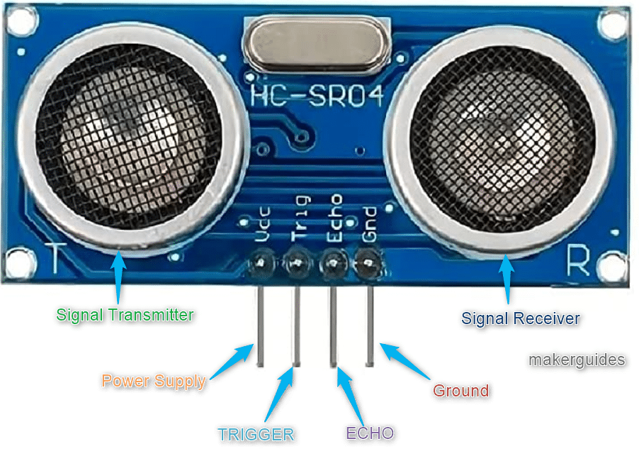
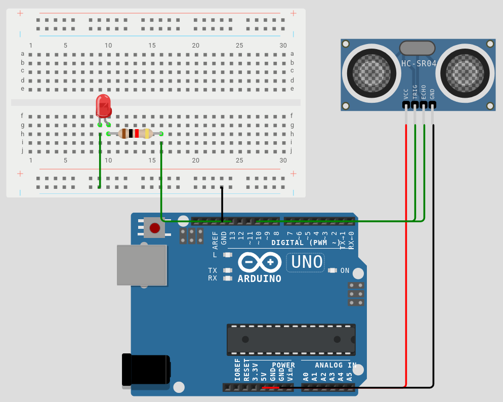

# Week 5 - Sensors I: Distance & Proximity

**Deliverable:** A proximity alarm that triggers an LED when an object comes within a defined distance, using an HC-SR04 ultrasonic sensor.

---

## 1. Background

### 1.1 What is a Sensor?

A sensor is a device that converts a physical quantity into an electrical signal that a microcontroller can read. They are essential in robotics, playing a role of one of the most important input devices.

### 1.2 The HC-SR04 Ultrasonic Sensor

The HC-SR04 measures distance by emitting a burst of ultrasonic pulses at 40kHz (humans cannot hear it) and measuring the time it takes for the echo to return after reflecting off an object. This principle is identical to sonar used in submarines and bats' echolocation.

The sensor has four pins:

- **VCC** — 5V power supply
- **GND** — ground
- **TRIG** — trigger input; a 10µs HIGH pulse on this pin initiates a measurement
- **ECHO** — output; the pin goes HIGH for a duration equal to the round-trip travel time of the sound pulse

The effective range of the HC-SR04 is approximately 2cm to 400cm.



### 1.3 Deriving the Distance Formula

The time measured by the ECHO pin is the total round-trip time — the sound travels from the sensor to the object and back again. To convert this time to a one-way distance, the physics involved is as follows.

The speed of sound is 343 metres per second. Converting to centimetres per microsecond:

```
343 m/s × 100 cm/m ÷ 1,000,000 µs/s = 0.0343 cm/µs
```

The ECHO duration, in microseconds, represents the time for the pulse to travel to the object and return. Since the pulse covers the distance twice, the one-way distance is:

```
distance = (duration × 0.0343) / 2
```

Rearranging to express the distance as a function of duration divided by a single constant:

```
distance = duration / (2 / 0.0343)
         = duration / 58.31
         ≈ duration / 58
```

Therefore, this constant is derived from the speed of sound.

It is also worth noting that the speed of sound varies with temperature, but for most indoor robotics applications this variation is negligible.

### 1.4 `pulseIn()`

`pulseIn(pin, HIGH)` is an Arduino library function that measures the duration of a pulse on a pin. It blocks execution until the specified pin goes HIGH, then counts microseconds until the pin returns LOW, and returns that count as a `long` integer. It is the mechanism by which the ECHO signal is converted into a duration value that can be used in the distance calculation.

```cpp
long duration = pulseIn(ECHO, HIGH); // returns microseconds
```

`long` is used rather than `int` because the maximum round-trip time at 400cm is approximately 23,000 microseconds, which exceeds the maximum value of a 16-bit `int` (32,767 on some platforms but only 32,767µs before overflow risk). `long` is a 32-bit integer and comfortably holds the full range of values the sensor can produce.

### 1.5 `delayMicroseconds()`

In previous weeks, `delay()` was used for all timing. `delay()` operates in milliseconds and is too coarse for the trigger pulse, which must be exactly 10 microseconds. `delayMicroseconds(10)` provides microsecond-level timing resolution for this purpose.

---

## 2. Circuit

### Components required

- 1× Arduino Uno
- 1× HC-SR04 ultrasonic sensor
- 1× LED
- 1× 220Ω resistor
- Jumper wires
- Breadboard

### Pin assignments

- Pin 9 — TRIG (output)
- Pin 10 — ECHO (input)
- Pin 13 — LED alarm (output)

### Wiring




---

## 3. Code

```cpp
const int TRIG = 9;
const int ECHO = 10;
const int ALARM = 13;
const int THRESHOLD = 20; // centimetres

long getDistance() {
    digitalWrite(TRIG, LOW);
    delayMicroseconds(2);
    digitalWrite(TRIG, HIGH);
    delayMicroseconds(10);
    digitalWrite(TRIG, LOW);

    long duration = pulseIn(ECHO, HIGH);
    return duration / 58;
}

void setup() {
    pinMode(TRIG,  OUTPUT);
    pinMode(ECHO,  INPUT);
    pinMode(ALARM, OUTPUT);
    Serial.begin(9600);
}

void loop() {
    long distance = getDistance();

    Serial.print("Distance: ");
    Serial.print(distance);
    Serial.println(" cm");

    if (distance < THRESHOLD) {
        digitalWrite(ALARM, HIGH);
    } else {
        digitalWrite(ALARM, LOW);
    }

    delay(100);
}
```

---

## 4. Explanation

### Constants

`TRIG`, `ECHO`, `ALARM`, and `THRESHOLD` are all declared as named constants at the top of the file. Writing `if (distance < 20)` embeds the value invisibly in the logic; writing `if (distance < THRESHOLD)` makes the intent explicit and the value easy to find.

### `getDistance()`

The function begins by pulling TRIG LOW for 2 microseconds. This ensures the pin is in a known state before the trigger pulse, clearing any residual HIGH that might have been left from a previous call.

`digitalWrite(TRIG, HIGH)` followed by `delayMicroseconds(10)` produces the 10µs HIGH pulse required by the HC-SR04 to initiate a measurement. `digitalWrite(TRIG, LOW)` ends the pulse. The sensor responds by emitting eight 40kHz ultrasonic bursts and then raising the ECHO pin HIGH.

`pulseIn(ECHO, HIGH)` waits for the ECHO pin to go HIGH, then measures how long it stays HIGH in microseconds. This duration is the round-trip travel time of the sound pulse. Dividing by 58 converts it to centimetres as derived in section 1.3, and the result is returned to the caller.

### `setup()`

TRIG is configured as OUTPUT because the Arduino drives it to trigger measurements. ECHO is configured as INPUT because the sensor drives it and the Arduino reads it. `Serial.begin(9600)` initialises serial communication so distance values can be monitored in real time.

### `loop()`

`getDistance()` is called once per iteration and the result stored in `distance`. The value is printed to the Serial Monitor with units, which allows the sensor's behaviour to be observed directly.

The `if/else` block compares `distance` against `THRESHOLD`. If the object is closer than 20cm, the alarm LED is turned on, otherwise it is turned off.

`delay(100)` limits measurements to ten per second. Without it, `pulseIn()` would be called thousands of times per second, and the Serial Monitor would be flooded with data faster than it can display. 100ms is short enough to feel responsive and long enough for the sensor to complete each measurement cleanly before the next trigger pulse is sent.

---

### Additional tasks

1. Replace the fixed `THRESHOLD` with a dynamic one read from a potentiometer on A0 using `map(analogRead(A0), 0, 1023, 5, 100)`. The detection range can then be adjusted by turning the knob without modifying or re-uploading the code.
2. Add a second threshold for a two-stage alarm: yellow LED on when closer than 40cm, red LED on when closer than 15cm. This requires two `if` checks