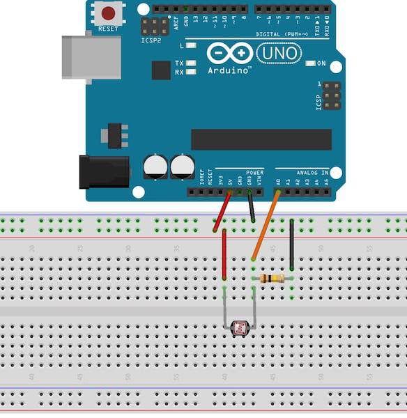
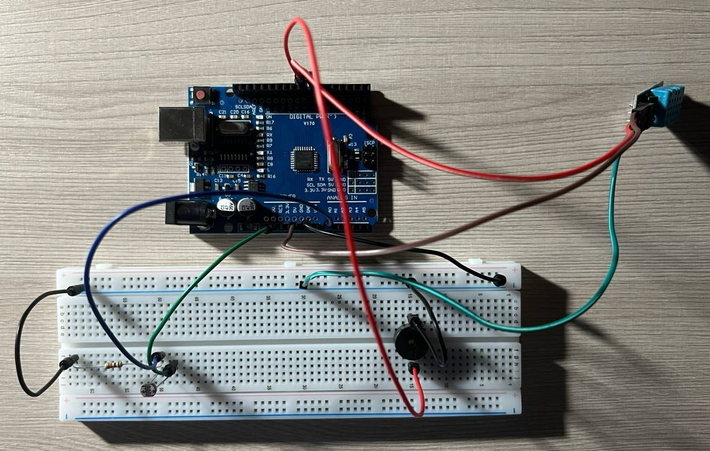

# Week 6 - Sensors II: Light & Environment

**Deliverable:** An environmental monitor that reads ambient light with a photoresistor and temperature/humidity with a DHT11 sensor, triggers a buzzer alarm in low-light conditions, and reports all values to the Serial Monitor

---

## 1. Background

### 1.1 Categories of Sensors

Sensors differ not only in what they measure but in how they communicate their readings to the microcontroller. This week introduces two fundamentally different types:

A **resistive analog sensor** (the photoresistor) changes its electrical resistance in response to a physical quantity. The Arduino reads it indirectly — a voltage divider circuit converts the changing resistance into a changing voltage, which `analogRead()` converts to a number between 0 and 1023. No special library is needed

A **digital protocol sensor** (the DHT11) performs its own internal measurement and transmits the result as a series of digital pulses using a defined communication protocol. The Arduino must decode this pulse sequence correctly to extract the temperature and humidity values. Because implementing this decoding from scratch is complex and error-prone, it is handled by an external library written and tested by others. This introduces the concept of libraries: reusable code that extends what Arduino can do without requiring the programmer to understand the implementation details

---

### 1.2 The Photoresistor (LDR)

A photoresistor, also called a Light Dependent Resistor (LDR), is a component whose resistance decreases as the intensity of incident light increases. In complete darkness, its resistance may be several megaohms; in bright light, it may fall to a few hundred ohms

Because `analogRead()` measures voltage rather than resistance, the photoresistor cannot be connected directly to an analog pin. It must be placed in a **voltage divider** circuit with a fixed resistor. In a voltage divider, two resistors are connected in series between 5V and GND. The voltage at the junction between them depends on the ratio of the two resistances:

```
V_out = 5V × R_fixed / (R_LDR + R_fixed)
```

As light increases, R_LDR decreases. With a fixed resistor of 10kΩ in the lower position (between the junction and GND), a lower R_LDR raises V_out — brighter light produces a higher `analogRead()` value. This is why the 10kΩ resistor is specified: it is chosen to sit in the middle of the LDR's typical resistance range, giving the widest possible spread of readable values across normal lighting conditions



---

### 1.3 The DHT11 Temperature and Humidity Sensor

The DHT11 has three relevant pins: VCC (3.3–5V), GND, and DATA. The DATA pin carries a proprietary single-wire protocol: when triggered, the sensor sends 40 bits of data: 8 bits of humidity integer, 8 bits of humidity decimal, 8 bits of temperature integer, 8 bits of temperature decimal, and 8 bits of checksum

Decoding 40 bits of timed pulses manually would require careful use of `pulseIn()` calls and bit manipulation. The DHT sensor library, written by Adafruit, handles all of this internally and exposes two simple function calls: `dht.readTemperature()` and `dht.readHumidity()`

**Accuracy:** The DHT11 is an entry-level sensor. Its temperature accuracy is ±2°C and humidity accuracy is ±5% RH

---

### 1.4 The Buzzer

The kit contains a passive buzzer. A passive buzzer requires an oscillating signal to produce sound, it contains no internal oscillator. `digitalWrite(BUZZER, HIGH)` alone produces no sound; it needs a rapidly alternating HIGH/LOW signal. The Arduino `tone()` function handles this:

```cpp
tone(pin, frequency);    // start producing a tone at the given Hz
noTone(pin);             // stop
```

Frequency is in Hertz. 440Hz is concert A; 1000Hz is a mid-range beep suitable for an alarm. `tone()` uses a hardware timer internally and is non-blocking.

If the kit contains an active buzzer (which has an internal oscillator), `digitalWrite(BUZZER, HIGH)` alone produces sound and `tone()` is not needed. The two types look identical externally; the active buzzer usually has a small PCB or black covering on the bottom. Both are handled in the code below.

---

## 2. Installing the DHT Library

Before uploading any code, the DHT sensor library must be installed in the Arduino IDE:

1. Open the Arduino IDE.
2. Go to **Sketch → Include Library → Manage Libraries**.
3. Search for **DHT sensor library** by Adafruit.
4. Click **Install**. When prompted, also install the **Adafruit Unified Sensor** dependency.

The library only needs to be installed once per machine.

---

## 3. Circuit

### Components required

- 1× Arduino Uno
- 1× Photoresistor (LDR)
- 1× 10kΩ resistor (for voltage divider)
- 1× DHT11 sensor
- 1× Buzzer (passive or active)
- 1× 220Ω resistor
- Jumper wires
- Breadboard

### Pin assignments

- A0 — photoresistor voltage divider output (analog input)
- Pin 7 — DHT11 DATA (digital input)
- Pin 8 — Buzzer (digital output)

### Wiring



---

## 4. Code

```cpp
#include <DHT.h>

const int LDR_PIN   = A0;
const int DHT_PIN   = 7;
const int BUZZER    = 8;

const int LDR_THRESHOLD = 300; // below this = dark
const int DHT_TYPE      = DHT11;

DHT dht(DHT_PIN, DHT_TYPE);

void setup() {
    pinMode(BUZZER, OUTPUT);
    pinMode(LED,    OUTPUT);
    Serial.begin(9600);
    dht.begin();
    Serial.println("Environmental monitor ready.");
}

void loop() {
    // light reading
    int lightLevel = analogRead(LDR_PIN);
    int brightness = map(lightLevel, 0, 1023, 0, 255);

    if (lightLevel < LDR_THRESHOLD) {
        tone(BUZZER, 1000);
    } else {
        noTone(BUZZER);
    }

    // dht11 reading
    float humidity    = dht.readHumidity();
    float temperature = dht.readTemperature();

    if (isnan(humidity) || isnan(temperature)) {
        Serial.println("DHT11 read failed. Check wiring.");
    } else {
        Serial.print("Light: ");
        Serial.print(lightLevel);
        Serial.print(" / 1023  |  Temp: ");
        Serial.print(temperature);
        Serial.print(" C  |  Humidity: ");
        Serial.print(humidity);
        Serial.println(" %");
    }

    delay(1000);
}
```

---

## 5. Explanation

### Library import and object instantiation

`#include <DHT.h>` makes the DHT library's code available to this sketch. Without this line, the compiler has no knowledge of the `DHT` type or any of its methods.

`DHT dht(DHT_PIN, DHT_TYPE)` creates a DHT object named `dht`, configured for the correct pin and sensor model. This line sits outside all functions so the object is global so that both `setup()` and `loop()` can access it. This is the first time students encounter an object: a variable that bundles data and behaviour together. The details of how the object works internally are hidden inside the library; the programmer only needs to know what it can do.

### `setup()`

`dht.begin()` initialises the sensor and must be called before any readings are taken. It is the DHT equivalent of `pinMode()`.

### Light reading in `loop()`

`analogRead(LDR_PIN)` samples the voltage at the junction of the voltage divider. In a well-lit room, `lightLevel` will typically be in the range of 600–900. In darkness, it may fall below 100. The exact values depend on the specific LDR and the ambient lighting conditions.

`map(lightLevel, 0, 1023, 0, 255)` rescales the ADC range to the PWM range, as established in Week 3. `analogWrite(LED, brightness)` sets the LED brightness proportionally to light level.

The `if/else` block compares `lightLevel` against `LDR_THRESHOLD`. If the value falls below 300 (which should correspond to a moderately dim environment — adjust based on observed readings), `tone(BUZZER, 1000)` starts a continuous 1kHz tone on the buzzer pin. `noTone(BUZZER)` stops it when light returns. Because `tone()` is non-blocking, the rest of `loop()` continues executing while the tone plays.

### Temperature and humidity reading

`dht.readHumidity()` and `dht.readTemperature()` return `float` values. Both are called once per loop iteration. The return type `float` is new this week: unlike `int`, it can represent fractional values such as 23.5°C.

`isnan()` checks whether a value is "Not a Number" — the value the DHT library returns when a read fails, which happens if the sensor is not wired correctly, the pull-up resistor is missing, or the DATA line has noise. Checking for this before printing prevents meaningless values from appearing in the Serial Monitor and makes the failure mode explicit and diagnosable.

### `delay(1000)`

The DHT11 cannot be sampled more than once per second. The 1000ms delay at the end of `loop()` enforces this constraint.

