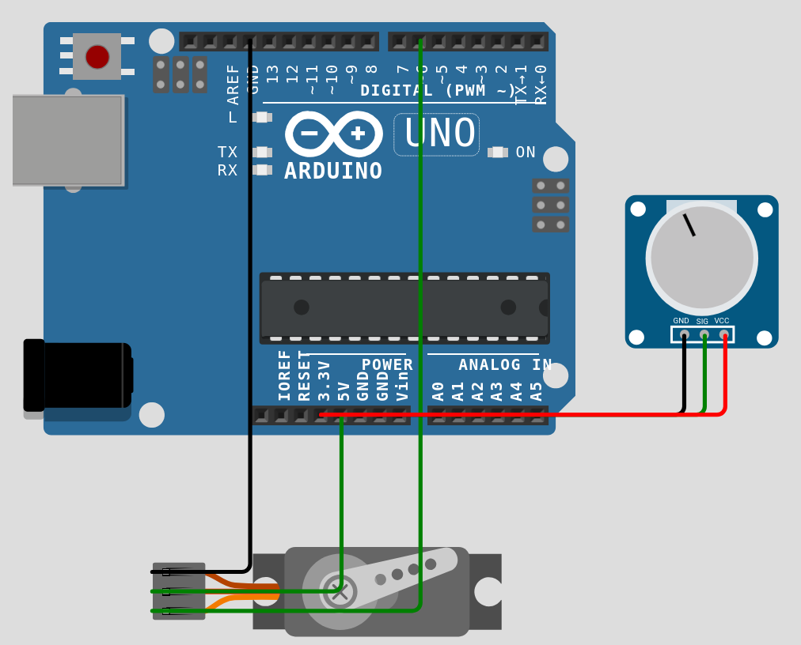

# Week 7 - Actuators: Motors & Motion

**Deliverable:** A servo motor whose position is controlled in real time by a potentiometer, with a stepper motor running a fixed rotation sequence and a buzzer signalling the start of each cycle.

---

## 1. Background

### 1.1 What is an Actuator?

While a sensor converts a physical quantity into an electrical signal that the microcontroller can read, an actuator does the opposite - it converts an electrical signal from the microcontroller into a physical action.
Actually, we have already covered actuators, those are LEDs and buzzers. Motors are actuators too. This week focuses on the most popular servo motor.

### 1.2 The Servo Motor (SG90)

A servo motor is a motor combined with a gearbox, a position sensor, and a control circuit. Unlike a regular DC motor which simply spins, a servo moves to and holds a specific angular position. The SG90 has a range of 0° to 180°.

The servo is controlled by a PWM signal on a single wire. The pulse width encodes the target position. A pulse of 1ms corresponds to 0°; a pulse of 2ms corresponds to 180°; pulses in between map linearly to intermediate angles. The signal repeats at approximately 50Hz (every 20ms). The internal control circuit of the servo reads the pulse width and drives the motor until the measured shaft position matches the commanded position.

Implementing this pulse timing manually with `analogWrite()` is possible but cumbersome. The `Servo.h` library, included with the Arduino IDE, handles it entirely.

The SG90 draws up to 700mA under load, which exceeds what an Arduino pin can provide (40mA maximum). It must be powered from the 5V pin on the Arduino board, which is connected directly to the USB power supply rather than routed through the microcontroller. The signal wire connects to a digital pin.

---

## 2. Libraries

Both motor libraries are included with the Arduino IDE and require no separate installation.

`Servo.h` is used for the servo motor. A `Servo` object is created globally, attached to a pin in `setup()`, and commanded with `servo.write(angle)` where angle is 0–180.

`Stepper.h` is used for the stepper motor. A `Stepper` object is created with the number of steps per revolution and the four control pins. `stepper.setSpeed(rpm)` sets the rotation speed in revolutions per minute. `stepper.step(n)` moves the motor n steps; a negative value reverses direction.

---

## 3. Circuit

### Components required

- 1× Arduino Uno
- 1× SG90 servo motor
- 1× Potentiometer
- Jumper wires
- Breadboard (not used in the simulation)

### Pin assignments

- A0 — potentiometer wiper (analog input)
- Pin 6 — servo signal (PWM output)

### Wiring




---

## 4. Code

```cpp
#include <Servo.h>

const int POT_PIN   = A0;
const int SERVO_PIN = 6;

Servo myServo;

void setup() {
    myServo.attach(SERVO_PIN);
    Serial.begin(9600);
}

void loop() {
    int raw    = analogRead(POT_PIN);
    int angle  = map(raw, 0, 1023, 0, 180);
    myServo.write(angle);

    Serial.print("Raw: ");
    Serial.print(raw);
    Serial.print("  Angle: ");
    Serial.println(angle);

    delay(15);
}
```

---

## 5. Explanation

### `Servo` object

`Servo myServo` creates a servo object at global scope. `myServo.attach(SERVO_PIN)` in `setup()` associates it with pin 6 and begins generating the PWM signal. From this point, `myServo.write(angle)` is all that is required to move the servo.

### Servo position tracking in `loop()`

`analogRead(POT_PIN)` returns 0–1023. `map(raw, 0, 1023, 0, 180)` converts this to a degree value. `myServo.write(angle)` commands the servo to move to that angle. The servo's internal control loop drives the motor until the shaft reaches the commanded position and holds it there. Turning the potentiometer is immediately reflected in the servo's position.

`delay(15)` gives the servo time to reach its new position before the next command is issued